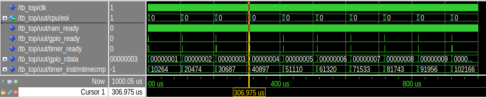
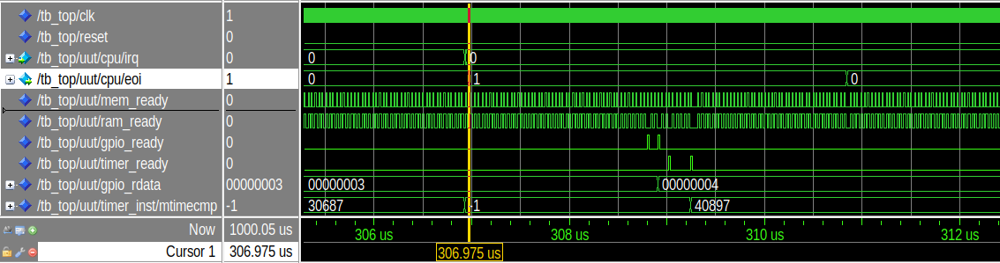
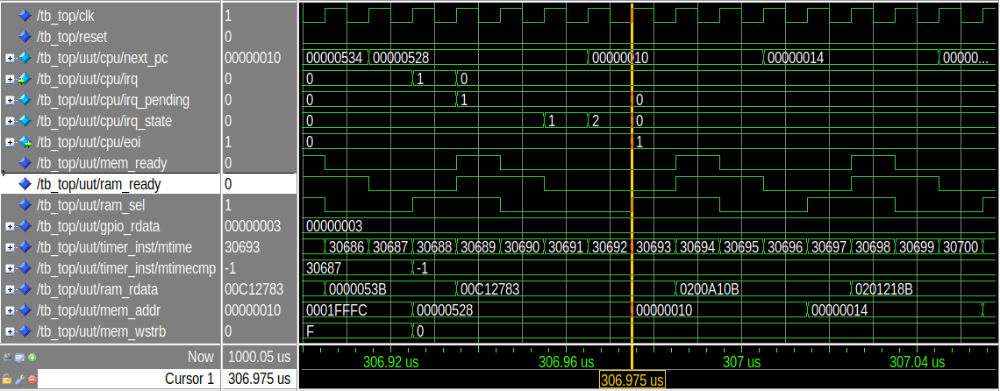
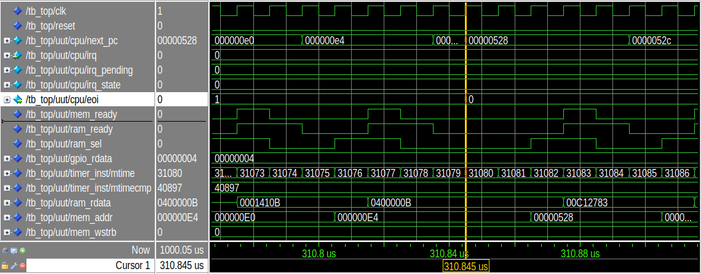

# RISC-V Nano-SoC

A minimalist System-on-Chip (SoC) based on the [**PicoRV32**](https://github.com/YosysHQ/picorv32/tree/main) softcore (RISC-V). 

My work consisted in:
* Using the **picorv32.v** and interface it with my modules.
* Implementing **peripherals** in both **VHDL** and **Verilog** (RAM, Timer, GPIO).
* Developing **interrupt** processing based on a hardware timer. It included the implementation of a **bootloader** in **RISC-V** assembly, and a **C** program for IRQ handling.
* Setting up an automated **DevOps** environment (**Makefile**, [**VUnit**](https://vunit.github.io/), **GCC**).
* Simulation on **Modelsim**.

Project developed to deepen knowledge in Soc architecture: FPGA, RISC-V architectures, bare metal C and DevOps.

---

## System Architecture

The SoC uses simple address decoding logic to map peripherals onto the CPU data bus:

| Peripheral | Address Range | Description |
| :--- | :--- | :--- |
| **Memory** | `0x00000000` - `0x0001FFFF` | Vectors, code and data storage (128 KB) |
| **GPIO** | `0x10000000` | Output register |
| **Timer** | `0x20000000` | For periodic interrupt |

### Key Features:
* **CPU**: PicoRV32 (RV32I).
* **Firmware**: Firmware architecture, compilation and bootloading of bare metal C programs.
* **Interrupts**: Interrupt handling based on the Timer.
* **Bus**: Peripheral selection logic.
* **Reset**: Synchronous reset across all modules (CPU, RAM, GPIO).

---

## Development Environment

The project integrates a DevOps hardware simulation stack:

* **Local Simulation**: ModelSim.
* **Test Framework**: [VUnit](https://vunit.github.io/) (Python-based automation).
* **Toolchain**: `riscv64-unknown-elf-gcc`.
* **Build System**: GNU Make.

* **Note**: Git CI is difficult to configure for a multi-language SoC.

---

## Repository Structure

* **rtl/**: VHDL/Verilog source files for the SoC (CPU, RAM, GPIO, Timer, Top).

* **sw/**: C firmware source, HEX generation script (makehex.py), Bootloader (start.S), Linker Script, and the Makefile to generate *sw/firmware.hex*.

* **sim/**: VHDL testbenches using VUnit and Modelsim configuration.

* **run.py**: Main VUnit test script.

* **Makefile**: Root orchestrator for the entire project.

---

## Demo

### 1. Long run
An interrupt is handled every 100 $\mu s$, and increment GPIO.



### 2. Zoom on a single interrupt: process

1) The current state of the program (registers, PC, SP) is stored in a dedicated IRQ stack.
2) The C function *IRQ_handle.c* is called.
3) The state of the original program is restored, and execution continue from where it was interrupted.



### 3. Zoom on interrupt trigger: handling

1) The timer expires (*mtime* reach *mtimecmp*), then triggers the CPU's *IRQ* input signal and sets *mtimecmp* to 0xFFFFFFFF to disable *IRQ*, waiting for *mtimecmp* to be set back by *irq_handle.c*.
2) The CPU handles interruption and sends *mem_addr* to 0x00000010, where the interrupt vector is stored (via the bootloader).
3) Execute the interrupt process described in 2.



### 4. Zoom on the return to main program
1) The program address returns to 0x528, where the interrupt occured.
2) The registers have been returned to the main program and have been restored.
3) The program continues.



## Performance of the Interrupts

At **100 MHz** (1 cycle = 10 ns):

| Step | Duration (ns) | Clock Cycles |
| :--- | :--- | :--- |
| **CPU Latency** | 90 ns | 9 |
| **Store CPU State** | 1770 ns | 177 |
| **IRQ Handler Execution** | 430 ns | 43 |
| **Restore CPU State** | 1550 ns | 155 |
| **Total Latency** | **3410 ns** | **341** |

**Total Overhead:** ~3.4 $\mu s$.

---

## Memory & Stack Architecture

I developed a bootloader (*start.S*) and defined the memory layout (*linker.ld*) inspired by the PicoRV32 design. The resulting memory map and stack architecture are as follows:

* **`00000000` <start>**: Entry point of the program. Initializes the stack pointers and jumps to `main`.
* **`00000010` <irq_vec>**: IRQ vector. It saves CPU registers into the `<irq_regs>` space using PicoRV32's `qregs`, calls `<irq_handler>`, and finally restores the context.
* **`00000200` <irq_regs>**: Dedicated memory space to store CPU registers while the Stack Pointer (SP) is used by the handler.
* **`00000480` <irq_stack>**: Top of the IRQ stack.
* **`00000514` <main>**: Main program loop.
* **`00000538` <irq_handler>**: C function that handles the interrupt logic and updates `mtimecmp` for the next event.

--- 

## How to run

### 1. Install Dependencies
Install [Modelsim](https://www.altera.com/downloads/simulation-tools/modelsim-fpgas-standard-edition-software-version-20-1-1).

To install VUnit (within a Python virtual environment) and the toolchain:

```bash
pip install vunit_hdl
sudo apt install gcc-riscv64-unknown-elf
```

### 2. Compile and Simulate (GUI)
In, the Makefile a the root of the repo:

To automatically compile the C firmware (It runs sw/Makefile to get hex firmware) and launch VUnit tests:

```bash
make
```

To compile and launch ModelSim GUI with pre-configured signals:
```bash
make gui
```

To only launch tests:
```bash
make test
```

In sw/Makefile:

To get program architecture with addresses for debugging, run:
```bash
make debug
```

---

## Testing

The project integrates **Unit Testing** using **VUnit**. Scenarios defined in *sim/tb_top.vhd* include:

* **test_loop_increment**: Validates the full data path (Fetch -> Exec -> Write GPIO).

* **test_reset_recovery**: Verifies that the PC, RAM, Timer, and GPIO correctly return to zero after a reset signal.

* **test_long_run**: Analyzes processor stability over an extended execution period.

To launch the test, run the Python program *run_VUnit.py*.

## References

https://cese.ewi.tudelft.nl/computer-engineering/docs/RISCV_CARD.pdf
https://cese.ewi.tudelft.nl/computer-engineering/add_resources.html#risc-v-register-map
https://github.com/YosysHQ/picorv32/tree/main
